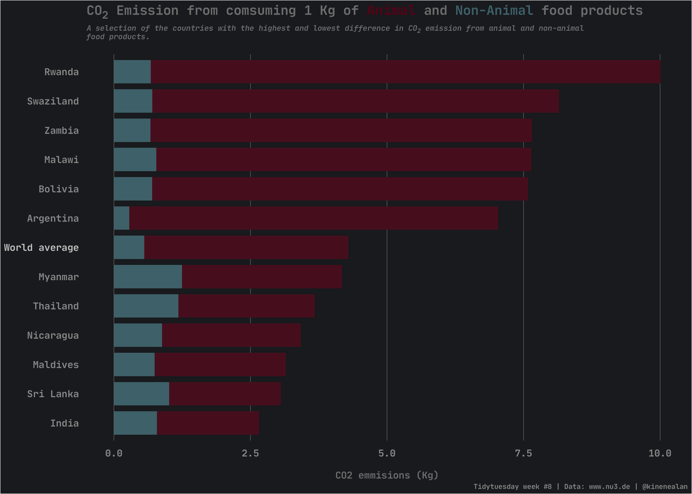
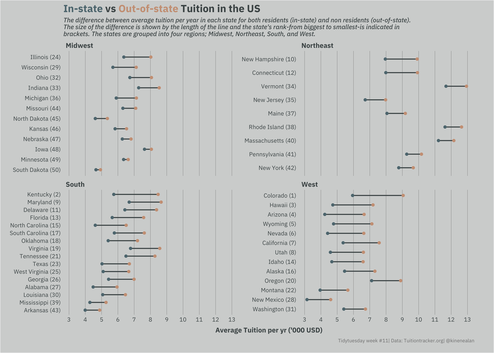
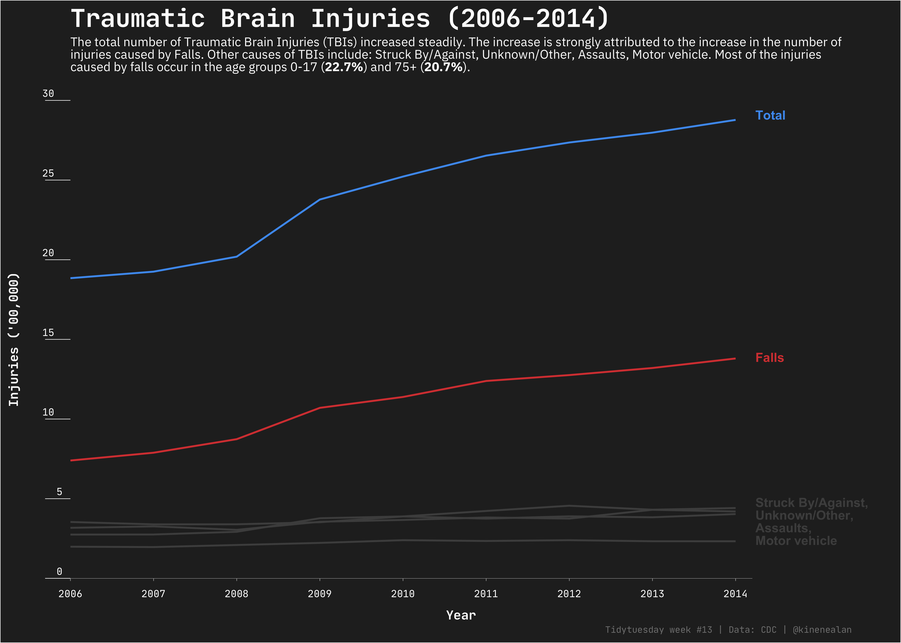

# TidyTuesday
My contributions to the [Tidytuesday](https://github.com/rfordatascience/tidytuesday) data visualization challenge.

# 2020

## Week 8

## Week 9

## Week 10

## Week 11

## Week 12

## Week 13

